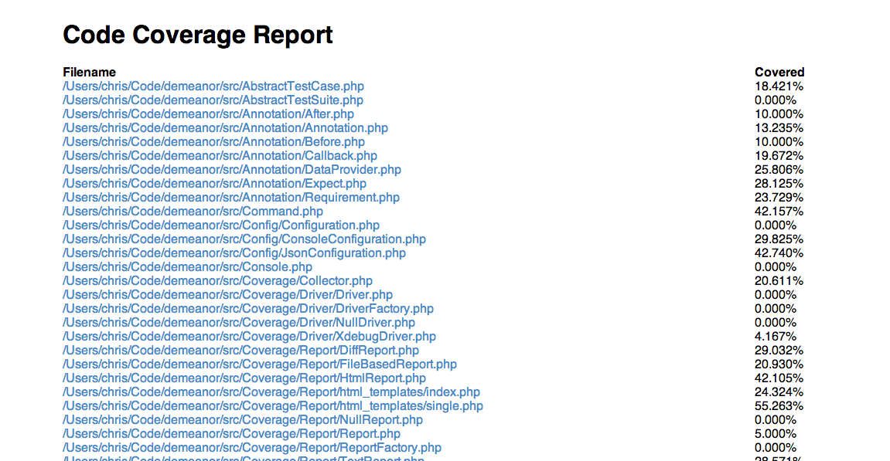

Code Coverage
=============

The :ref:`code coverage <code-coverage-config>` configuration section has some
detailed documentation on how to configure code coverage.

A Warning
---------

Demeanor does code coverage *only* based on a whitelist as defined in the
:ref:`configuragion <code-coverage-config>`.

If no ``directories``, ``files``, or ``glob`` patterns are defined, no real
coverage reporting will be generated. These things *must* be set up in ``demanor.json``.

Types of Coverage Reports
-------------------------

Demeanor can generate several types of coverage reports. There are three valid
types that may be used in the ``reports`` configuration key or specified via
the :ref:`CLI <code-coverage-cli-config>`.

#. html
#. diff
#. text

Unrecognized types are simply ignored.

HTML Coverage Reports
^^^^^^^^^^^^^^^^^^^^^

These are HTML files that show covered lines in green along with the filename
and a percent covered number.

Coverage Index:

Coverage for a single file:

Diff Coverage Reports
^^^^^^^^^^^^^^^^^^^^^

Diff coverage reports are a series of "diff" files. Each generated file has a +
in front of any line that was covered. While HTML reports include information
about what test covered what line, diff reports don't.

Text Coverage Reports
^^^^^^^^^^^^^^^^^^^^^

A test coverage report is simply a list of files with their percent covered numbers

.. code-block:: text

    /Users/chris/Code/demeanor/src/AbstractTestCase.php 18.421%
    /Users/chris/Code/demeanor/src/AbstractTestSuite.php 0.000%
    /Users/chris/Code/demeanor/src/Annotation/After.php 10.000%
    /Users/chris/Code/demeanor/src/Annotation/Annotation.php 13.235%
    /Users/chris/Code/demeanor/src/Annotation/Before.php 10.000%
    /Users/chris/Code/demeanor/src/Annotation/Callback.php 19.672%
    /Users/chris/Code/demeanor/src/Annotation/DataProvider.php 25.806%
    /Users/chris/Code/demeanor/src/Annotation/Expect.php 28.125%
    /Users/chris/Code/demeanor/src/Annotation/Requirement.php 23.729%
    /Users/chris/Code/demeanor/src/Command.php 42.157%
    /Users/chris/Code/demeanor/src/Config/Configuration.php 0.000%
    /Users/chris/Code/demeanor/src/Config/ConsoleConfiguration.php 29.825%
    /Users/chris/Code/demeanor/src/Config/JsonConfiguration.php 42.740%

A few special values can be used for the text report output path.

``STDERR`` will write the report to, as one might expect, stderr.

.. code-block:: bash

    # write a coverage report to stderr
    ./vendor/bin/demeanor --coverage-text STDERR

``STDOUT`` will write the report to stdout.

.. code-block:: bash

    # write a coverage report to stdout
    ./vendor/bin/demeanor --coverage-text STDOUT
